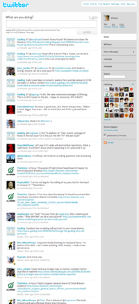

Recently, many blogs have gotten into the habit of putting links to all of their posts on Twitter. Sure, this lets their followers find out about new posts in real time, but it’s really stepping into the territory of [RSS](http://www.whatisrss.com/) feeds. While at first a blogger might think they’re getting their posts out to two sets of readers&mdash;RSS subscribers and Twitter followers&mdash;I think in the long run it hurts their readership. Here are just five reasons why:

## 1. Tweets “expire”

While of course tweets will be forever archived and [searchable](http://search.twitter.com/search?q=my+first+tweet), Twitter has a very strong of-the-moment nature. When you check your timeline, you see the most recent tweets from friends. Anything that’s older than a certain time is going to be overlooked. When I come across a link to a blog post in my timeline, I feel compelled to click on it now because there’s no built-in mechanism for coming back to it later. My email inbox and RSS feeds will wait until I’m ready.

## 2. It’s redundant clutter

It’s enough of a battle to keep up with everyone’s witty comments and hilarious links, but now even full-length blog posts are thrown into the mix. Twitter is for short and sweet messages&mdash;you don’t check your timeline with the intention of cozying up to a half hour of blog reading.

## 3. RSS is organized, Twitter is not

And it shouldn’t be. Twitter is for quick tidbits, all of a similar nature. RSS feeds come in from all over the web, and most users have them categorized in their favorite [reader](http://www.google.com/reader/view/).

## 4. Twitter is about identity, RSS is for link dumping

Twitter is for personal correspondence or [retweeting](http://bloggingbits.com/the-art-and-science-of-retweeting-for-twitteraholics/) interesting tidbits. Link dumps, like RSS feeds, have no personality&mdash;why should I follow one? I can’t reply to it, and it won’t write to me, so why bother? Corporate blogs should use Twitter to reach out to their audience and humanize themselves.

## 5. You’re not letting readers follow you in their own way

This one has a bit of crossover with points 2 and 3. I’ve got my online reading routine, and I want to consume content in a particular way. Tweeting links forces me out of this routine, but not in a way where I can still manage things. I’ve got my blog posts and news in my RSS feeds and I’d like them to stay there, thankyouverymuch. I know you just made a killer post, and I’ll read it&mdash;when I get to my RSS feeds.

## What to do instead

Use Twitter as a reminder of your blog or to highlight really special posts. Tweet about one post a week, or maybe one a day if you’re really high-volume. Or as, [@Gadling](http://twitter.com/Gadling) does, time-shift selected posts&mdash;chances are, if a reader skips over an RSS item from 7am, they may just catch that 6pm tweet.
