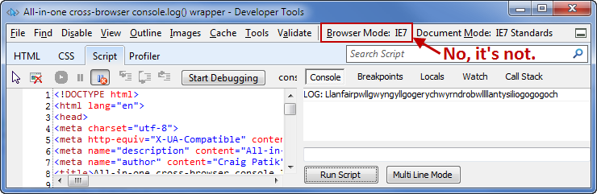
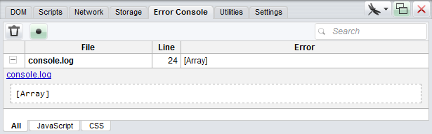
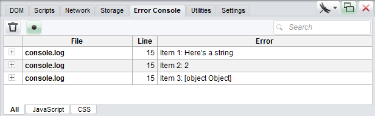

_Update: I’ve made a significant update to this project which is targeted at primitive consoles (IE, Opera 11 and older, iOS 5 and older, and more). A separate blog post has [more details](detailed-console-logging) or you can jump right to the [updated Github repo](https://github.com/patik/console.log-wrapper). The original post below still applies._

Many front-end web developers make use of the wonderful browser consoles that have matured in the past few years. While the tried-and-true `console.log()` often does the trick, its lack of support (particularly in IE) has led to the use of proxy functions, such as [Paul Irish’s console.log wrapper](http://paulirish.com/2009/log-a-lightweight-wrapper-for-consolelog/) and [Ben Alman’s Debug()](http://benalman.com/code/projects/javascript-debug/docs/files/ba-debug-js.html) which prevent unsupportive browsers from throwing errors.

I had a need for logging data in _every_ browser, not just ones that natively support `console.log()`. So I forked Paul’s function and expanded it to work with every browser I could test — IE6-9, Firefox 3.6 & 4+, Chrome 10+, Safari 5+, and Opera 11+.

This will be exhaustive, so you may want to jump directly to:

**[Live Demo](https://patik.github.io/console.log-wrapper/)**&nbsp;&bull;&nbsp;[Github Repo](https://github.com/patik/console.log-wrapper)

## Current state of the console

Like Paul’s implementation, we’re simply going to create a function called `log()` and pass along any arguments it receives to `console.log()`. But before that we need to do a little setup to ensure that, when possible, console.log() is properly defined as a function in every browser.

First, let’s review console support in today’s browsers:

- Chrome, Safari, Opera: native `console.log()`
- Firefox: native `console.log()` with Firebug
- IE9: native `console.log()`, but it needs a little nudge to turn on
- IE8: While `console.log()` exists, it’s an object rather than a function — But we can still write to the console with a clever trick.
- Others: We can inject [Firebug Lite](http://getfirebug.com/firebuglite) which will define `console.log()` as a function

Note that when I talk about IE I’m referring to the native versions — “IE8” means IE8, _not_ IE9 switched to IE8 mode with the <abbr title="No, I'm not going to prefix that with 'F12'">Developer Tools</abbr>.



### IE9

Before we build `log()` we need to tell IE9 to use its own console and to consider `console.log()` to be a function. Many thanks to [Andy E](http://whattheheadsaid.com/2011/04/internet-explorer-9s-problematic-console-object) for this piece.

```js
if (typeof console.log == "object" && Function.prototype.bind && console) {
    ["log","info","warn","error","assert","dir","clear","profile","profileEnd"]
        .forEach(function (method) {
        console[method] = this.call(console[method], console);
    }, Function.prototype.bind);
}
```

For this particular case we really only need to define the `log` method, but it can’t hurt to flip the switch on the others as well.

## Modern browsers

Now we can define `log()`. There’s no sense in re-inventing a very round wheel, so I’m just going to fork [Paul Irish’s original console.log wrapper](http://paulirish.com/2009/log-a-lightweight-wrapper-for-consolelog/).

```js::highlight-7
if (!window.log) {
    window.log = function () {
    log.history = log.history || [];  // store logs to an array for reference
    log.history.push(arguments);
    if (typeof console.log == 'function') {
        // Modern browsers
        if ((Array.prototype.slice.call(arguments)).length == 1 && typeof Array.prototype.slice.call(arguments)[0] == 'string') {
            console.log( (Array.prototype.slice.call(arguments)).toString() );
        }
        else {
            console.log( Array.prototype.slice.call(arguments) );
        }
    }
    // to be continued...
```

Notice that `if()` condition on line 7. Paul’s use of `Array.prototype.slice.call()` is great because you can pass along any amount and variety of objects, strings, functions, etc directly to the console. However, there’s one unfortunate side effect: in Firebug and Chrome (and possibly others), if the argument array’s sole content is a single string greater than 50 characters, it will be truncated faster than you can say [Llanfair&shy;­pwllgwyngyll&shy;­gogery&shy;­chwyrn&shy;­drobwll&shy;­llan&shy;­tysilio&shy;­gogo&shy;­goch](http://en.wikipedia.org/wiki/Llanfairpwllgwyngyllgogerychwyrndrobwllllantysiliogogogoch).

So we’ll check the array length, and if it’s 1, and that 1 thing is a string, then we’ll convert the entire argument array to a string before passing it along. You could use `console.error()` to avoid truncation, but then it will look like an error when it’s not.

### Opera

_**Update:** Since I first wrote this post, Opera has updated Dragonfly such that the console now properly displays basic types&mdash;arrays are enumerated, objects are presented in a tree-like structure, etc. I have removed the `if (window.opera) {` section from the code. You can ignore this section and skip down to <a href="#ie8">IE8</a>. I’ll leave this section in place in case anyone has a need to test on Opera 11._

So that takes care of the modern browsers… except Opera. Opera seems to display the arguments as a whole `Array()` rather than splitting them apart. So if you passed several arguments you’d just see this:



And that’s not too helpful. We can get around this with a rather boring `while()` loop to log each argument one by one.

```js::highlight-4
var log = function () {
    // Modern browsers
    if (typeof console != 'undefined' && typeof console.log == 'function') {
        // Opera 11
        if (window.opera) {
            var i = 0;
            while (i &lt; arguments.length) {
                console.log("Item " + (i+1) + ": " + arguments[i]);
                i++;
            }
        }
        // All other modern browsers
        else if ((Array.prototype.slice.call(arguments)).length == 1 && typeof Array.prototype.slice.call(arguments)[0] == 'string') {
            console.log( (Array.prototype.slice.call(arguments)).toString() );
        }
        else {
            console.log( Array.prototype.slice.call(arguments) );
        }
    }
    // to be continued...
```

Which results in:



It’s a little messy and if you use `log()` a lot you’ll find that your console will fill up fast, so you’ll have to decide how important Opera support is to you.

## <a name="ie8" href="#ie8">IE8</a>

As we discussed earlier, IE8 has a console but your scripts can’t call `console.log()` directly, so we’re going to add a special condition for it. [Andy’s aforementioned post](http://whattheheadsaid.com/2011/04/internet-explorer-9s-problematic-console-object) included a similar bit of code for writing to IE8’s console, however in actual IE8 (as opposed to IE9 switched to IE8 mode) `Function.prototype.bind` is not defined. Instead, I’m using [@kangax](http://twitter.com/kangax/status/56059642433900544)’s alternative, `Function.prototype.call.call()`.

```js::start-21
    else if (!Function.prototype.bind && typeof console != 'undefined' && typeof console.log == 'object') {
        Function.prototype.call.call(console.log, console, Array.prototype.slice.call(arguments));
    }
```

One slight alteration: I changed the second part of the condition from `console` to `typeof console != 'undefined')`. It seems a little silly, but IE7 actually throws an error without the `typeof` check.

## Older browsers

Now we’re going to inject [Firebug Lite](http://getfirebug.com/firebuglite) (“FBL”) for all the other browsers — namely, IE7 and older — by adding a `<script>` tag to the DOM. (Personally, I like FBL better than IE’s and Opera’s consoles anyway, so you may want to use this for any browser where `(typeof console.log != 'function' || window.opera)` is true.) Doing this will expose `console.log()` as a function, which means your calls to `log()` will end up being handled by the “Modern browsers” section in the beginning of the function.

You can pull it directly from getfirebug.com, or use a local copy (point to the `/path/to/firebug-lite/<strong>build</strong>/firebug-lite.js` file).

In my experience FBL takes a few moments to load and begin accepting console logs, even locally. To compensate for this delay, this piece of code is split into two conditions. The first one loads FBL and will only run the first time you call `log()`:

```js::start-24
    else {
        // Inject Firebug lite
        if (!document.getElementById('firebug-lite')) {
            // Include the script
            var script = document.createElement('script');
            script.type = "text/javascript";
            script.id = 'firebug-lite';
            script.src = '/lib/js/firebug-lite/build/firebug-lite.js';
            // If you want to expand the console by default, uncomment this line
            //document.getElementsByTagName('HTML')[0].setAttribute('debug','true');
            document.getElementsByTagName('HEAD')[0].appendChild(script);
            setTimeout(function(){log(Array.prototype.slice.call(arguments));}, 1500);
        }
        else {
            // Script was included but hasn't finished loading yet
            setTimeout(function(){log(Array.prototype.slice.call(arguments));}, 500);
        }
    }
} // the end of log()
```

The second condition is caught when your script calls `log()` before FBL has finished loading. Notice the id that I added to the `<script>` tag in the first condition — that tells us that FBL has begun loading. But since `console.log` is still not defined (otherwise we wouldn’t have gotten to this point in the code) we know that the script hasn’t fully loaded yet. Therefore we can simply use a `setTimeout` to try our call again every half second until it succeeds.

## <abbr title="'Oh my god. Becky, look at her butt.'">“It is so big”</abbr>

Yeah, it is. Compared to Paul’s 6 lines, this version is a beast. But consider this: you log to the console during _development_. You’re not going to leave this in your production code (I hope!). So this function — and let’s face it, it’s not _that_ long, especially when minified — is likely to be used only via localhost or over a LAN connection. I think the ability to log data in every browser is well worth a couple dozen lines of code tucked out of sight down at the bottom of `dev.js`.

I look forward to any suggestions or improvements you may have.

[Live Demo](https://patik.github.io/console.log-wrapper/)&nbsp;&bull;&nbsp;[Github Repo](https://github.com/patik/console.log-wrapper)
