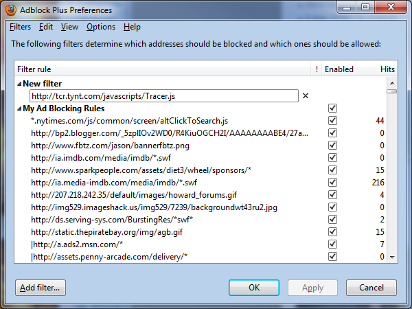

Many news sites, from [Wired](http://www.wired.com/) to my [local newspaper](http://www.timesunion.com/), have taken to adding a ‘feature’ to their articles&mdash;any text you copy and paste is [silently broadcast to another site](http://yro.slashdot.org/story/10/01/14/1818222/Tynt-Insight-Is-Watching-You-Cut-and-Paste). That other site, [Tynt](http://www1.tynt.com/see-whats-copied), keeps track of what you copy and paste to your friends in an effort to track demographics.


While some find it useful that Tynt also appends the URL of the article you’re viewing, many find the behavior obtrusive and a violation of their privacy. Want to share a snippet of a story with a friend? Go ahead, Tynt (and presumably the news site) are watching.

**Here’s how to get rid of it**, depending on your browser of choice.

## Firefox

With AdBlock installed, open the AdBlock preferences&mdash;either through the Tools menu or with the shortcut Ctrl-Shift-E. Click Filters > Add new, then paste in this line:

```txt
http://tcr.tynt.com/javascripts/Tracer.js
```



## Chrome

Chrome as a few ad-blocking extensions, such as [AdBlock](https://chrome.google.com/extensions/detail/gighmmpiobklfepjocnamgkkbiglidom) and [AdThwart](https://chrome.google.com/extensions/detail/cfhdojbkjhnklbpkdaibdccddilifddb). Once one is installed, go to your extensions page by clicking the wrench icon in the upper right corner of Chrome, then choose Extensions. Open your extension’s options and add the same line shown above for Firefox.

## Internet Explorer, and everyone else

First, ask yourself why you’re not using a safer, [faster](http://www.google.com/chrome), [better](http://www.mozilla.com/firefox/) browser. Surprisingly, Internet Explorer version 8 does offer ad-blocking. Follow [these easy steps from ghacks.net](http://www.ghacks.net/2009/04/08/internet-explorer-8-ad-blocking/) to block this script.
