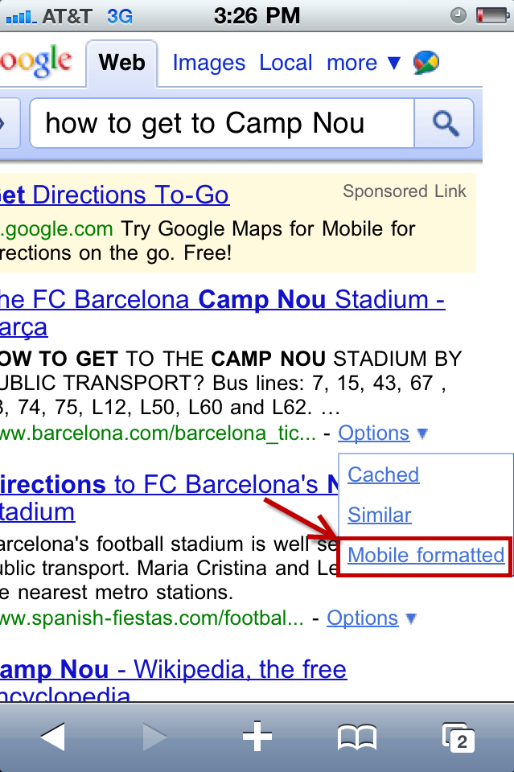
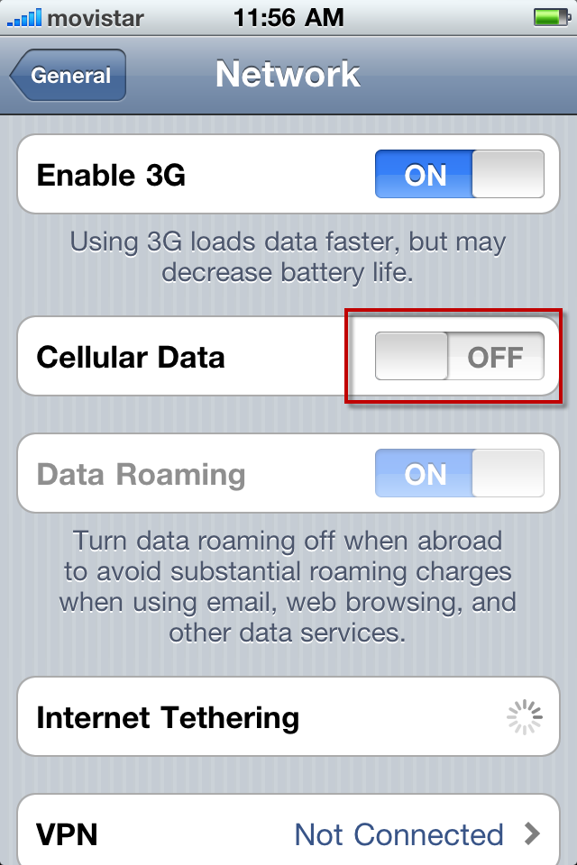
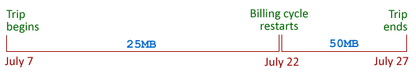

If you’re preparing to travel overseas and you’ve had an iPhone for any amount of time you’re probably excited about its usefulness as a travel aid. In particular, you’ll be keen to make use of its always-on Internet connection.

But you’ve probably heard the horror stories of arriving home to a thousand-dollar cell phone bill littered with roaming charges. Fortunately, you have some options to make use of your iPhone’s capabilities outside of the United States.

While this topic has been [covered](http://www.eurocheapo.com/blog/using-an-american-iphone-in-europe%E2%80%A6-without-going-broke.html 'http://www.eurocheapo.com/blog/using-an-american-iphone-in-europe%E2%80%A6-without-going-broke.html') [before](http://www.wired.com/gadgetlab/2009/02/how-to-take-you/ 'http://www.wired.com/gadgetlab/2009/02/how-to-take-you/'), most approaches are far too conservative. You don’t want to spend your entire vacation with your iPhone locked down in airplane mode, or constantly toggling Data Roaming on and off&mdash;nor do you need to. That defeats the entire purpose of a smartphone and prevents you from enhancing your trip with the iPhone’s many tools.

_Note that this post is specific to US American AT&T users, but the fundamental principles still apply to other smartphones on other carriers. It is also a bit Europe-centric&mdash;I’m just sticking to what I have experience with._

_I also assume that you’re familiar with what a SIM card is, as well as the difference between voice and data where cellular networks are concerned._

## An Offline Frame of Mind

When your iPhone is in its most helpful state, it’s probably consuming a lot of data, which unfortunately is your primary concern when it comes to roaming charges. So the first order of business is to concentrate on orienting yourself to being less network-reliant. This isn’t as daunting as it may seem.

An important note to consider is that **native apps** tend to consume far less data than web browsing. For example, it uses a trivial amount of data (tens of kilobytes) to complete a simple FourSquare check in, so have a ball boasting about all the exotic locations you’re visiting. (Just be safe and [don’t overshare](http://www.gadling.com/2010/04/21/social-networking-and-travel-dos-and-donts/ 'http://www.gadling.com/2010/04/21/social-networking-and-travel-dos-and-donts/').) And while [Google Translate](http://translate.google.com/ 'http://translate.google.com/')‘s mobile interface is slim, consider an app such as [iTranslate](http://www.itranslate.cc/ 'http://www.itranslate.cc/') which will only transfer the actual text you’re translating.

If you must perform a simple Google search away from wifi, hit the mobile link for a stripped down (read: image-lite and less data gobbling) version of the site.

### A Few ‘Offline’ Tips

- #### Wifi

    This seems a bit obvious, but try to book hotels with free wifi. Assuming your travel is for leisure, you’ll probably want to enjoy your day and save the web browsing, RSS feeds, and Facebook for when you’re unwinding in your room at the end of a long day.

    Save your cellular data for the situations that are truly helpful while on foot&mdash;finding out where you are, checking for nearby points of interest, and verifying other time sensitive information.You can also use a service such as [JiWire](http://www.jiwire.com/ 'http://www.jiwire.com/') and their [Wi-Fi Finder](http://www.jiwire.com/iphone 'http://www.jiwire.com/iphone') app to find and download a map of wifi locations in your city.

- #### Maps

  Perhaps the killer app of the iPhone when it comes to travel is its mapping capabilities and location awareness. Maps, however, are extremely data-intensive, so you’ll want to have them preloaded on your device.

  - **OffMaps** (99 cents) is an excellent app which allows you to freely download maps. On the ground, it will utilize the phone’s (free, non-data-consuming) GPS abilities to display your position on the map. (It can, of course, stream maps on-the-fly if you have a generous data plan.) It typically locates you within a second or two; it’s much faster than the GPS devices of the past.Before you leave home, use the maps to download the maps at several zoom levels for the destinations you will be at. A typical city may take a couple hundred megabytes at the most detailed zoom level, so be sure to use Wifi. You might also consider their useful but less-than-polished city guides which highlight sights, hotels, restaurants, and other travel-related points of interest collated from WikiTravel.org and other free sources (in-app purchase; first one’s free, then 99 cents for three or $9 for unlimited).
  - **Navigation apps** (various products and prices, usually $40-$100) are available for many worldwide locations if you intend to do some driving. Just make sure you choose the right region, and that the maps are included in the download for offline access.

- #### Guides

  Search the App Store for the name of your destination city or country and you’ll find a range of guides, from basic “WikiTravel in a nice package” apps to sleek but more costly Lonely Planet guides. Also consider using a service like [Instapaper](http://www.instapaper.com/ "http://www.instapaper.com/") to collect articles and download them to your phone using the Instapaper app. As a last resort, paste the text into an email or the Notes app.Or you could just lug around a dead-tree guidebook, which has its benefits.

- #### Toggle Cellular Data

  An easy way to ensure no data will be sent over your cellular connection, while still maintaining the ability to make and receive phone calls and use the phone’s location awareness, is to turn off cellular data in Settings.

  

  That’s it. _**There is no need to turn on airplane mode**_ to avoid data usage. Note that you do not need to explicitly turn off data roaming when toggling this setting.

  If you’re confident that you’ve turned off all background processes (fetching mail, etc) then you can just leave cellular data flipped on to avoid the hassle of constantly toggling it. I recommend testing this at least once: make note of your current data usage (e.g., dial #3282* if you’re on AT&T’s plan described below), leave the phone idle for an hour or two, then check your data usage again and make sure it hasn’t gone up. If it has, you’ve still got something running in the background.

## Getting Connected

You have three basic choices when it comes to connecting to a cellular network abroad. The first is the cheapest but requires a bit of research and a little leg work at your destination, while the other two are more expensive but just plain work with no hassle.

1. ### Foreign SIM Card

    This is the cheapest option which gives you the most flexibility, and depending on the country, even the possibility of having so much data at your disposal you won’t even need to monitor your usage. Unfortunately, it requires [jailbreaking](http://en.wikipedia.org/wiki/IOS_jailbreaking "http://en.wikipedia.org/wiki/IOS_jailbreaking") and unlocking your device. This has its own implications; I’ll leave it up to the reader to decide whether this is a path worth taking, and to figure out how to do it (the process and ability depends on your [device and OS version](http://www.jailbreakmatrix.com/ "http://www.jailbreakmatrix.com/"), not to mention your tech savviness).If you do unlock your phone, you will be free to use any SIM you can find. You will quite likely want to use a contract-free prepaid SIM which will allow you to just pay for what you use and can usually be found all over, from airports to convenience stores to specialty phone shops. These options are country-specific, so if you’re traveling to three or more countries you’ll want to look into “global SIM” cards such as [Telestial](http://www.telestial.com/view_product.php?ID=MSIM-EX01 "http://www.telestial.com/view_product.php?ID=MSIM-EX01") or [GO-SIM](http://www.gosim.com/?gosimusa "http://www.gosim.com/?gosimusa").

    Start by perusing the [Pay As You Go SIM Wiki](http://paygsimwithdata.wikia.com/wiki/Pay_as_you_go_sim_with_data_Wiki "http://paygsimwithdata.wikia.com/wiki/Pay_as_you_go_sim_with_data_Wiki") and [PrepaidGSM.net](http://prepaidgsm.net) which includes a roundup of the options for each country, listing the data and voice rates. It may seem a little daunting at first, so concentrate on the data rate and assume you’ll use Skype for voice calls. Note that the main legacy carriers, such as Vodafone, O2, Orange, and T-Com — the rough European equivalents to AT&T, Verizon, et al — are ubiquitous and feel ‘safe’, but there also exists a culture of “virtual operators” who utilize the big companies’ networks but offer lower rates. Often these VOs (or sometimes MVNOs) will specialize in some ‘angle’ that may not work for everyone, such as cheap data subsidized by more expensive voice calls — which is actually just what you want. (Think of low cost airlines like RyanAir which offer cutthroat prices based on limited services and alternate airports&mdash;it’s not entirely mainstream-friendly but it may just suit your needs.)

    Take a moment to peruse the site’s forums for tips on your country and read about people’s experiences, taking into consideration how recent the posts are.Once you’ve narrowed your options down to three or four networks, head over to other travel forums such as [FlyerTalk](http://www.flyertalk.com/forum/index.php "http://www.flyertalk.com/forum/index.php") or Lonely Planet’s [Thorn Tree](http://www.lonelyplanet.com/thorntree/ "http://www.lonelyplanet.com/thorntree/") and search for the network’s name to see what people have to say.

    Finally, **write down three or four operators** (on paper or digitally), as well as how/where to buy them, to bring with you on your trip. You can’t be sure exactly which SIMs you’ll actually be able to find, so it’s good to have a backup. You may get a different story from the shop clerk who says you can’t actually use the SIM as you’d expect, or they may be difficult to find in stock. A piece of paper also provides a convenient tool to hand to a non-English speaking clerk (unless you know the Dutch/Hungarian/Romanian/Turkish phrase for “I need a prepaid SIM card for my unlocked phone with a good data rate” and can interpret his or her possibly jargon-laden response).

    Note that the _availability_ of SIMs can vary in both senses of that word. For example, in the UK, SIM cards are practically given away&mdash;you can throw a stone in any direction and, after bouncing off a kebab joint, it will land in front of a shop selling £10 SIMs that come with £10 of credit (meaning the SIM is free assuming you use all the credit). Often these can be bought anonymously with cash. In the middle are countries like Spain and Germany which may require a passport and/or in-country address (the standard practice is to use your hotel’s address) to purchase a card. Then there are countries like Turkey, where the security theatre had ascended to the point where the SIM card vendor must verify your national tax ID (similar to an American social security number in both function and sensitivity) and register it with your SIM before it’s activated, meaning a foreigner is basically out of luck unless they have a good friend or family member willing to buy one for them.

2. ### AT&T’s International Data Package

    This option is as simple as it gets — just log in to your account on AT&T’s website and add an international data package to your account. Once you’re overseas, you’ll just use your iPhone like you would at home and it will work seamlessly.The catch? It’s not exactly cheap. You can choose from a paltry 20MB for $25, 50MB for $60, or even 100MB for a whopping $120. That’s not much data for a pretty hefty chunk of change. Figure that you’ll use about 50MB a month, or 12-15MB per week, if you’re careful about your usage and stick with the tips discussed above. You don’t want to go over&mdash;overage fees are an almost comical $5 per megabyte (though mercifully charged by the kilobyte should you go just a hair over).

    There’s one other point to consider which may or may not work out in your favor. The international data package takes affect immediately and is prorated, which may or may not align with your billing cycle and trip. Consider how the 50MB plan would pan out over the following example:

    

    In this example, notice how inconveniently the amount of data aligns with the actual trip. The first fifteen days, representing a sizable bulk of the trip, only gets 25MB, while the last 5 days have 50MB at their disposal. (True, you will still end up paying for the amount of data you actually use, but remember the overage fees compared to the normal price per MB, not to mention the convenience of having a lot of data available should you unexpectedly encounter a day or two of unavoidable high usage.)

    Here’s how it works, and why part of the trip only has 25MB available. The billing date here is the 22nd of the month, and the data plan began on the same day as the trip, the 7th. Since that’s only half of the billing cycle, you only get half of the data. When your next billing cycle begins, you’ll be reset back to the full 50MB. In this case, you’d be better off signing up on the 22nd of the previous month (June, in the above example) so that you have the whole 50MB available during your two-week trip. I’ve read that you can have this adjusted (so that the data charge aligns with the date of your trip instead of your billing cycle) by calling AT&T; I recommend talking to them first if your dates aren’t aligning in your favor.

3. ### Legit iPhone SIM providers

    These aren’t any cheaper per megabyte than AT&T’s plan, and they’re not as dead simple, but they give you a few more options. One example is [Mobility Pass](http://www.mobilitypass.com/iphone_voice_and_data_sim_card.html).

## Conclusion

If you’re comfortable with jailbreaking and unlocking your phone, and the country to which you’re traveling has SIMs available, then a 3rd party SIM is easily the cheapest and most flexible option.

If you don’t want to (or can’t) jailbreak or your country is on SIM lockdown, AT&T provides an easy-as-pie option at a cost.

Either way, you’ll need to follow good data usage practices to keep your usage at more of a minimum than you’re used to. Also be sure you’ve got all the apps you need and prepare them before leaving home.

Above all else, don’t forget to leave the iPhone in your pocket most of the time and enjoy your vacation!
