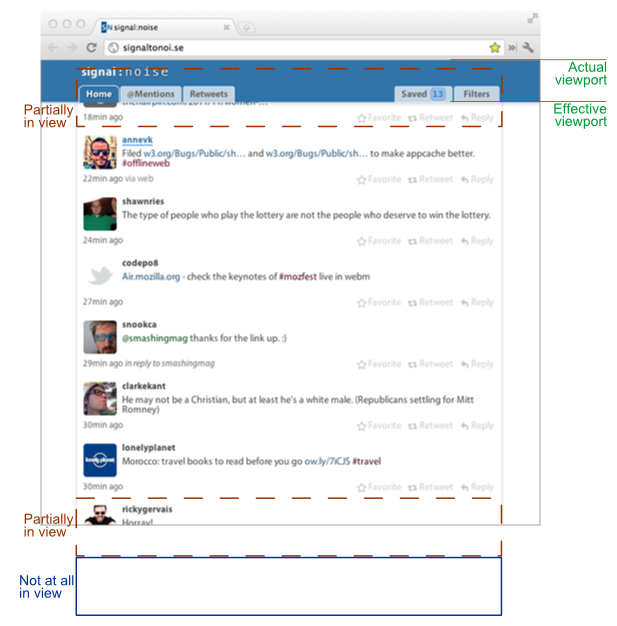

The viewport is a direct window into what the user sees, and a lot can be learned by watching it. In my previous post I introduced [Within Viewport](https://patik.github.io/within-viewport/) and I want to discuss how, particularly through my Twitter app [Signal~Noise](http://signaltonoi.se), I’ve found it useful in making interfaces respond sensibly to user behavior.

A common solution for developers looking to increase their site’s performance is to load data on demand, for example using [Infinite Scroll](http://www.infinite-scroll.com/). But sometimes the scroll position isn’t enough&mdash;you need to know about _the content_ on screen.

## Dynamic content loading

In Signal~Noise I want to control how heavier content is loaded. Since a tweet is a paltry 140 characters, and dynamically adding more of them to the top of a page causes it to scroll, it’s reasonable to start out by loading fifty or so at the initial page load. But when you factor in images and video previews linked within those tweets (which Signal~Noise presents inline) the page can take longer to load. I use Within Viewport to make sure I’m only loading media for tweets that are on screen or just about to be shown.

## Responding to user behavior

The obvious thing to do when a user reaches the boundary of their timeline is to load more tweets. But it takes time to call the Twitter API (possibly more than once), process that response, and send the new content back to the client. By comparing the number of tweets in the user’s field of view to the number that are out of sight, and tracking the speed with which those tweets move in and out view, the app can get a sense of the user’s momentum. With this knowledge the app can avoid calling the API too late (not having tweets ready to go) or too soon (unnecessarily hitting the API rate limit).

## Making appropriate measurements

The app also tracks each user’s reading position so the can resume reading at the same place in future sessions. When determining which tweets have been read, it only makes sense to consider ones that are fully in view. The app has a fixed header that shrinks the viewport by about 60 pixels, so I need to make sure a tweet is not covered by that.

## Live updates

My app also allows keyboard navigation from tweet to tweet, similar to [Google Reader](http://www.google.com/support/reader/bin/answer.py?answer=69973). When the user jumps to a tweet that is not completely visible, the app needs to know so it can scroll the page.

## Tracking usage

While not directly applicable to a Twitter app, you may want to find out what areas of your site a visitor actually sees. By firing events when sections move into and out of the viewport, you can use Google Analytics’ [Event Tracking](http://code.google.com/apis/analytics/docs/tracking/eventTrackerGuide.html) to find out how often users actually see parts of your page. Wondering why a particular widget doesn’t result in many click throughs? Perhaps the answer is as simple as not many people even get to see it.

## And more?

All that from just a viewport? I initially wrote Within Viewport to solve only one of the problems above, but I soon found many other uses for it. It wasn’t until I began using it that I realized, as obvious as this may seem, how pertinent the viewport is as an insight to the user’s experience.

If you have any other ideas, or suggested additions to the script, I’d love to hear them in the comments.
