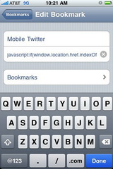

Twitter recently unveiled a [new interface for their mobile site](http://mashable.com/2009/12/03/twitter-mobile-3/) located at [mobile.twitter.com](http://mobile.twitter.com) loaded with the features you’re accustomed to having on the desktop version of the site. However, when you browse to Twitter or follow a link from an email on your mobile phone you’re still shown the older, far less useful interface by default.

To automatically view any page in the new interface, just use the [bookmarklet](http://en.wikipedia.org/wiki/Bookmarklet) below. If you’re currently on a Twitter page you’ll be redirected to the same page on mobile.twitter.com; or, if you’re anywhere else at all, you’ll simply go to the mobile home page.

The bookmarklet: <a href="javascript:if(window.location.href.indexOf('twitter.com')<0){window.location.host='mobile.twitter.com'} else if(window.location.host!=='mobile.twitter.com'){window.location.host='mobile.twitter.com';}">**Mobile Twitter**</a>

which links to:

```js
javascript:if(window.location.href.indexOf('twitter.com')<0){window.location.href='http://mobile.twitter.com/'} else if(window.location.href.indexOf('mobile.twitter.com')<0){window.location.href=window.location.href.replace(/(\w+\.)?twitter\.com/,'mobile.twitter.com');}
```

Or, to install it on an iPhone, follow these steps.

1. <a href="#___javascript:if(window.location.href.indexOf('twitter.com')<0){window.location.host='mobile.twitter.com'} else if(window.location.host!=='mobile.twitter.com'){window.location.host='mobile.twitter.com';}">Click here</a>, and bookmark the resulting page once it loads by clicking the + icon at the bottom of Mobile Safari. (It will look just like the page you’re on.) Call it something like “Mobile Safari”.
2. Tap the bookmarks icon to open your bookmarks, then click Edit
3. Tap on the bookmark you just made. Then tap on the second line, containing the URL, to edit it.
4. Hold your finger down on the URL until the magnifying glass appears. Slide your finger to the left until you see “#\_\_javascript”. Put the cursor just before “javascript”, then hit Backspace to clear out everything that comes before it.
5. Click Done. The URL should now be a bunch of code beginning with “javascript”



And that’s it. To use it, just open your bookmarks and tap on your new Mobile Twitter bookmarklet while you’re viewing any page.
