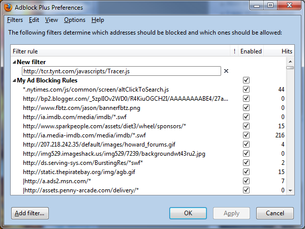
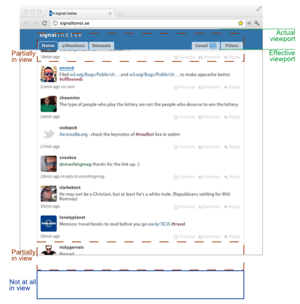
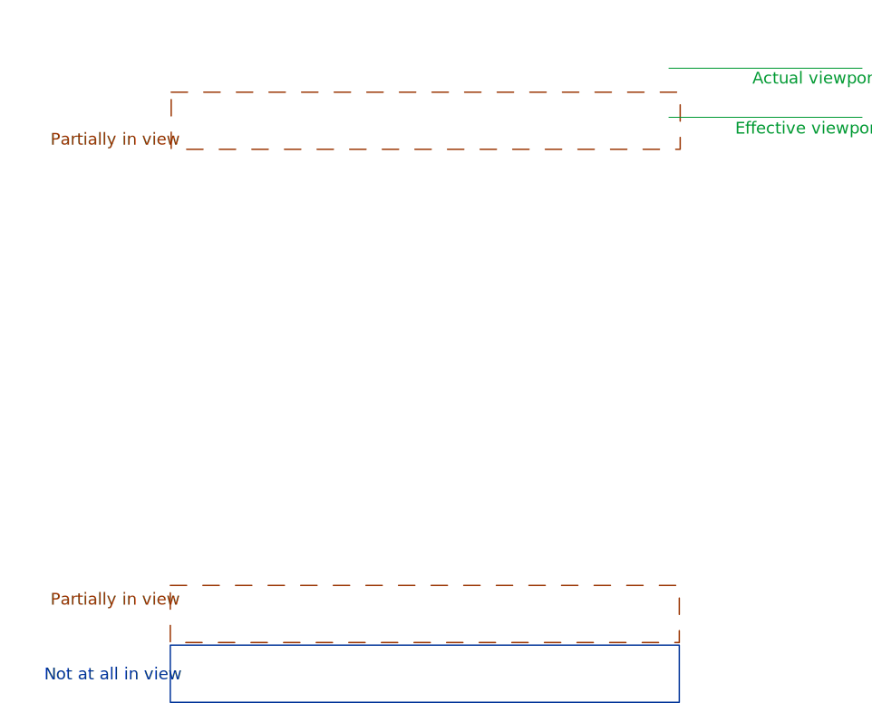

## Code fences

Language set

```js
if (!window.log) {
    foo()
}
```

No language set

```
if (!window.log) {
    foo()
}
```

### Line highlights

Single line

```js::highlight-2
if (!window.log) {
    foo() // This line should be highlighted
}
```

Multiple lines + range

```js::highlight-2,5-8
if (!window.log) {
    foo() // This line should be highlighted
}

const highlightMe = foo({
    high: 1,
    light: 2
})

bar()
```

### Starting line

```js::start-21
    // This is line 21
    hey()
    yo = 'alpha'
```

## HTML

A bookmarklet: <a href="javascript:if(window.location.href.indexOf('twitter.com')<0){window.location.href='https:\/\/mobile.twitter.com/'} else if(window.location.href.indexOf('mobile.twitter.com')<0){window.location.href=window.location.href.replace(/(\w+\.)?twitter\.com/,'mobile.twitter.com');}">**Mobile Twitter**</a>

Link: <a href="/blog/mobile-twitter-bookmarklet-displays-the-new-updated-twitter-on-your-smartphone/#___javascript:if(window.location.href.indexOf('twitter.com')<0){window.location.href='mobile.twitter.com'} else if(window.location.href.indexOf('mobile.twitter.com')<0){window.location.href=window.location.href.replace(/(\w+\.)?twitter\.com/,'mobile.twitter.com');}">Click here</a>.

Abbreviation: <abbr title="'Oh my god. Becky, look at her butt.'">“It is so big”</abbr>

Link to a heading: <a href="#html">HTML</a>

## Images

Standard MD, with a title:



### IMG in Figure with FigCaption

<figure>
    
    <figcaption><a href="https://patik.github.io/within-viewport/example_diagram.svg" target="_blank">Larger version</a></figcaption>
</figure>

### SVG in an IMG tag

Here: 

### SVG with Object

<object data="test.svg" type="image/svg+xml" width="617" height="626">
    
</object>

### SVG in Figure with FigCaption

<figure>
    <object data="test.svg" type="image/svg+xml" width="617" height="626">
        
    </object>
    <figcaption><a href="example_diagram.svg" target="_blank">Larger version</a></figcaption>
</figure>
